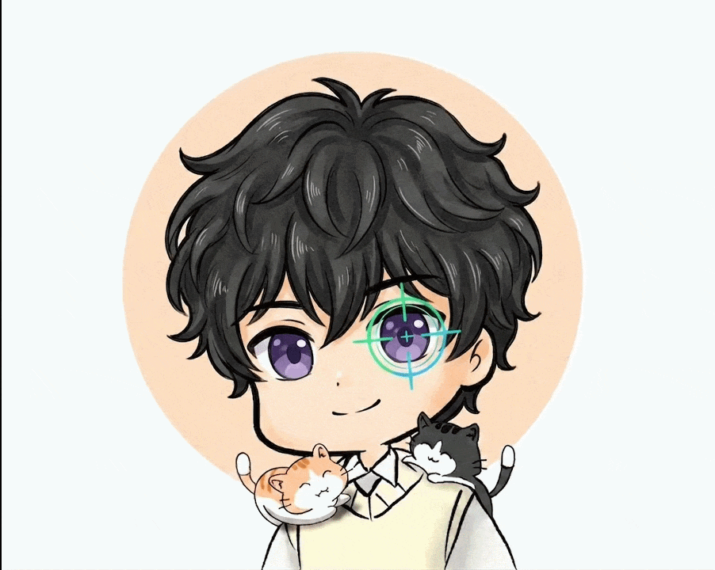

<h1 align="center">👋 What's Up? Nǐ hǎo, Wǒ shì Darunnaim Sindid</h1>
<h3 align="center">A passionate gamer and beginner game developer from Bangladesh.</h3>

<!-- ADDED GIF HERE -->

  

  

---

### 🔭 About Me

- 🔭 I’m currently working on **BookSwap - Book Exchange Platform, An Android App.**
- 🌱 I’m currently learning **Android Studio, Unreal Engine, Trading**
- 💬 Ask me about **Gaming, Esports, Game development, AI prompts, CFD Trading**
- 📫 How to reach me: **sindidas90@gmail.com** or **dquadofficialgg@gmail.com**
- ⚡ Fun fact: **I LOVE CATS 🐈**

---

<h3 align="center">Connect with me</h3>

  &nbsp;&nbsp;&nbsp;&nbsp;

---

<h3 align="center">Languages and Tools</h3>

  &nbsp;&nbsp;&nbsp;
    
  &nbsp;&nbsp;&nbsp;&nbsp;&nbsp;&nbsp;&nbsp;&nbsp;&nbsp;&nbsp;
    
  &nbsp;&nbsp;&nbsp;&nbsp;&nbsp;&nbsp;&nbsp;&nbsp;&nbsp;&nbsp;

---

<h3 align="center">GitHub Stats</h3>

  
  

 

  

 

  

